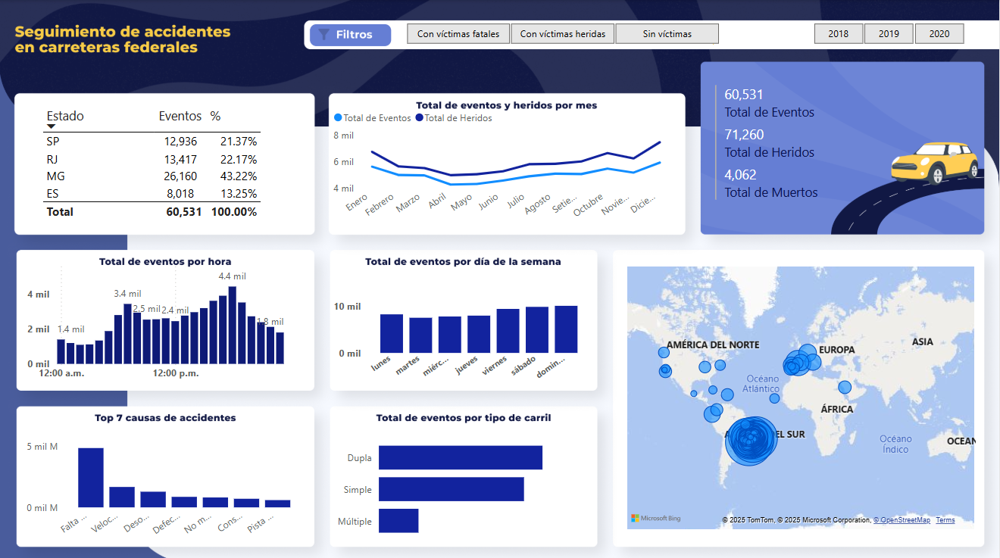

# 🚗📊 Dashboard de Seguimiento de Accidentes de Carretera

## 📌 Descripción
Este **Dashboard de Seguimiento de Accidentes de Carretera** permite analizar de manera visual e interactiva los incidentes ocurridos en carreteras federales. Proporciona información clave sobre la cantidad de eventos, heridos y fallecidos, así como patrones de ocurrencia por hora, día de la semana y principales causas.

## 🎯 Funcionalidades
- 📊 **Análisis de eventos por estado y porcentaje de ocurrencia**  
- ⏳ **Distribución de accidentes por hora del día y día de la semana**  
- ⚠️ **Identificación de las principales causas de accidentes**  
- 🛣️ **Clasificación de eventos según tipo de carril**  
- 🌍 **Mapa interactivo con la distribución geográfica de accidentes**  
- 🔎 **Filtros por tipo de accidente y año**
  
## **Archivo Power BI**  
El archivo de Power BI con el análisis se encuentra en la carpeta [powerbi](powerbi/).

